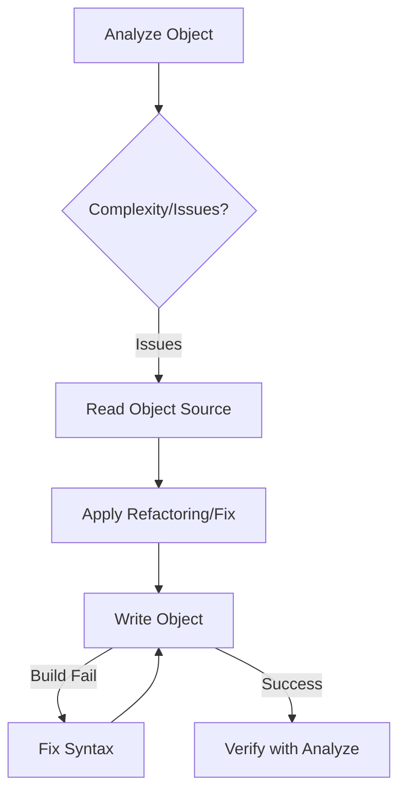

# 🎓 GeneXus MCP Mastery

This skill provides the definitive guide for using the **Genexus18MCP** server to interact with GeneXus 18 Knowledge Bases. It focuses on maximizing performance (via caching) and ensuring code quality (via the Native Linter).

## 🛠️ The Power Tools

| Tool                   | Best Use Case                                                            | Anti-Pattern                              |
| :--------------------- | :----------------------------------------------------------------------- | :---------------------------------------- |
| `genexus_analyze`      | **Always run first.** Checks complexity and lints for `COMMIT` in loops. | Running manual `grep` for logic.          |
| `genexus_read_object`  | Retrieval of Source/Rules. **Optimized with LRU Cache.**                 | Repeatedly reading without changes.       |
| `genexus_write_object` | Surgical edits to Source, Rules, or Events.                              | Writing invalid syntax (will fail build). |
| `genexus_batch`        | Large-scale refactors (multiple objects). Minimizes MSBuild overhead.    | Sending 10 individual `write` calls.      |

## 🚀 Performance Protocol (The LRU Cache)

The server maintains a **50-object In-Memory LRU Cache**.

- **Warm Reads**: `read_object` returns in <100ms.
- **Cold Reads**: Triggers MSBuild (3-5s).
- **Strategy**: When exploring a new module, read the core objects once. Subsequent analysis and refactoring will be near-instant.

## 🧠 Intelligence: The Native Linter

The `genexus_analyze` tool performs static analysis. Pay attention to the `insights` array:

1.  **CRITICAL**: `COMMIT` inside `For Each`.
    - _Fix_: Move the commit outside the loop to respect the LUW (Logical Unit of Work).
2.  **WARNING**: Dynamic `Call(&Var)`.
    - _Fix_: Use hardcoded object names to preserve the dependency tree.
3.  **INFO**: `New` without `When Duplicate`.
    - _Fix_: Always handle collision cases for data integrity.

## 🔄 Standard Workflow (The Loop)

## 🛡️ Resilience: Handling "Hangs"

The Gateway uses a **Circuit Breaker**.

- If the Worker process crashes, the Gateway restarts it automatically.
- **Agent Action**: If you see a timeout, simply retry the command once. The Gateway will have swapped the binary or restarted the pipe.

## 📝 GeneXus Coding Best Practices (for AI)

- **Variable Declarations**: GeneXus variables are often inferred, but you should declare them in the `Variables` part if adding new logic.
- **The Parm Rule**: Always check the `Rules` part before modifying parameters.
- **LUW Management**: Do not add manual `Commit` commands unless you are sure you are at the end of a logical transaction.
