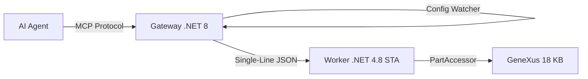

# GeneXus 18 MCP Server (Genexus18MCP) - v1.0.0

A high-performance **Model Context Protocol (MCP)** server for GeneXus 18, enabling AI agents (like Gemini, Claude, Cursor) to interact directly with your GeneXus Knowledge Base using the **Native GeneXus SDK**.

---

## [Main] Key Features (v1.0.0)

- **Native SDK Integration**: Interacts directly with the GeneXus Object Model (Artech.\* DLLs) for deep analysis and manipulation.
- **Dynamic Infrastructure**:
  - **Hot Reload (Config Watcher)**: The Gateway monitors `config.json` in real-time. Changing your KB in VS Code automatically restarts the Worker.
  - **Zero Hardcoding**: 100% path resolution via environment variables or dynamic config.
  - **Tool Registry Dinâmico**: Tool definitions reside in `tool_definitions.json`. The Gateway and AI share a single source of truth.
- **Intelligence & Context**:
  - **Recursive Context Injection**: Injects dependencies of dependencies (Procedures -> SDTs -> Domains) for complete AI reasoning.
  - **Business Component (BC) Awareness**: Automatically extracts BC structures during analysis.
- **Dual Process Stability**:
  - **Gateway (.NET 8)**: Handles protocol, hot-reloading, and stdio communication.
  - **Worker (.NET 4.8 x86)**: Runs in **STA Single-Thread Mode** for 100% SDK compatibility.

---

## [IDE] Nexus-IDE (Mini GeneXus IDE for VS Code)

The project includes **Nexus-IDE**, a lightweight VS Code extension that transforms VS Code into a mini GeneXus IDE by leveraging the MCP server.

- **Virtual File System**: Edit GeneXus objects directly in VS Code using the `genexus://` protocol.
- **KB Explorer**: Browse your Knowledge Base hierarchy directly from the Activity Bar.
- **Multi-Part Editing**: Seamlessly switch between **Source**, **Rules**, **Events**, and **Variables**.
- **Real-time Indexing**: Powered by the same high-performance engine as the MCP server.

---

## [Setup] Installation & Setup

### For Users (Recommended)

1. Install the `.vsix` in VS Code via **Extensions -> Install from VSIX**.
2. **Open your KB folder** in VS Code (where the `.gxw` file is).
3. The extension will **auto-discover** your KB and start the backend!

### For Developers (Build from Source)

#### 1. Build the Project
```powershell
.\build.ps1
```

#### 2. Configuration (`config.json`)
The system is now configuration-driven. Edit the `config.json` in the backend folder:
```json
{
  "GeneXus": {
    "InstallationPath": "C:\\Program Files (x86)\\GeneXus\\GeneXus18",
    "WorkerExecutable": "worker\\GxMcp.Worker.exe"
  },
  "Environment": {
    "KBPath": "C:\\KBs\\YourKB"
  }
}
```

---

## [Tools] Elite Toolset

Full documentation in `GEMINI.md`.

- **`genexus_query`**: Semantic search for objects and references (supports `usedby:`).
- **`genexus_read`**: Paginated source code reading (Base64 protected).
- **`genexus_edit`**: Surgical patching or full overwrite.
- **`genexus_batch_edit`**: Multi-object atomic edits.
- **`genexus_inject_context`**: Dynamic dependency injection (supports `recursive: true`).
- **`genexus_analyze`**: Navigation analysis, Linter, and Data Schema extraction.
- **`genexus_get_sql`**: Instantly extract SQL DDL (`CREATE TABLE`) for any Transaction or Table.
- **`genexus_test`**: Execute GXtest unit tests and get real-time results.

---

## [Arch] Architecture



---
**Current Version**: v1.0.0 (Official Release)  
**Status**: Stable & Deployment Ready
