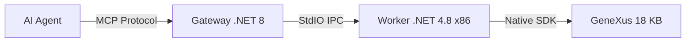

# GeneXus 18 MCP Server (Genexus18MCP)

A high-performance **Model Context Protocol (MCP)** server for GeneXus 18, enabling AI agents (like Claude, Cursor, Antigravity) to interact directly with your GeneXus Knowledge Base using the **Native GeneXus SDK**.

## 🌟 Key Features

- **Native SDK Integration**: Interacts directly with the GeneXus Object Model (Artech.\* DLLs) for deep analysis and manipulation.
- **Robust Assembly Resolution**: Automatically loads GeneXus packages and patterns from your installation folder.
- **x86 Architecture**: Optimized for the 32-bit GeneXus environment.
- **Structured Output**: All tools return optimized JSON for AI consumption (clean logs, diffs, metadata).
- **Dual Architecture**:
  - **Gateway (.NET 8)**: Handles MCP protocol and stdio communication.
  - **Worker (.NET 4.8 x86)**: Performs the actual GeneXus operations using the native SDK.

## 🛠️ Installation & Setup

### Prerequisites

- Windows 10/11 or Server.
- **GeneXus 18** installed (Tested with GeneXus 18 Upgrade 7+).
- **.NET 8 SDK** (for Gateway).
- **.NET Framework 4.8 SDK** (for Worker).

### 1. Build the Project

Run the included build script to compile and prepare the `publish/` directory:

```powershell
.\build.ps1
```

_Binaries will be placed in the `publish/` directory._

### 2. Configure `config.json`

Edit `publish\config.json` (created after first build):

```json
{
  "GeneXus": {
    "InstallationPath": "C:\\Program Files (x86)\\GeneXus\\GeneXus18",
    "WorkerExecutable": "GxMcp.Worker.exe"
  },
  "Environment": {
    "KBPath": "C:\\KBs\\YourKnowledgeBase"
  }
}
```

## 🤖 AI Agent Configuration (Cursor / Claude Desktop)

Add this to your MCP configuration file:

```json
{
  "mcpServers": {
    "genexus": {
      "command": "C:\\Projetos\\GenexusMCP\\publish\\GxMcp.Gateway.exe",
      "args": []
    }
  }
}
```

## 🧰 Available Tools

Detailed tool definitions are available in `GEMINI.md`.

- **Reader**: `genexus_list_objects`, `genexus_read_object`, `genexus_search`, `genexus_analyze`
- **Writer**: `genexus_create_object`, `genexus_write_object`, `genexus_refactor`, `genexus_batch`
- **DevOps**: `genexus_build`, `genexus_doctor`, `genexus_history`, `genexus_wiki`

## 📁 Repository Structure

- `src/`: Source code for Gateway and Worker.
- `publish/`: Compiled binaries and configuration.
- `docs/`: In-depth technical insights and research.
  - [Native SDK Insights](docs/native_sdk_insights.md): The definitive guide to GUIDs, Collisions, and Persistence.
- `scripts/`: Curated diagnostic and discovery PowerShell tools.

## 🏗️ Architecture



For more technical details on how the SDK integration was stabilized, see [docs/native_sdk_insights.md](docs/native_sdk_insights.md).
