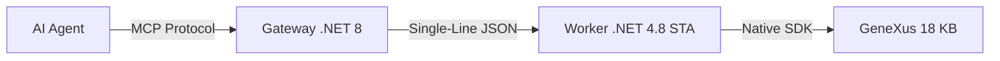

# GeneXus 18 MCP Server (Genexus18MCP)

A high-performance **Model Context Protocol (MCP)** server for GeneXus 18, enabling AI agents (like Claude, Cursor, Antigravity) to interact directly with your GeneXus Knowledge Base using the **Native GeneXus SDK**.

---

## [Main] Key Features

- **Native SDK Integration**: Interacts directly with the GeneXus Object Model (Artech.* DLLs) for deep analysis and manipulation.
- **Unified Discovery Engine**:
  - **Instant Search**: Local index-based search for KBs with 30,000+ objects.
  - **Direct GUID Access**: Bypasses slow UI lazy-loading, making code reading 100x faster.
  - **Semantic Ranking**: Results ranked by authority (most called) and relevance.
- **Bilingual Part Mapping**: Understands part names in both English and Portuguese (Source/Procedimento, Rules/Regras).
- **Dual Process Stability**:
  - **Gateway (.NET 8)**: Handles MCP protocol and stdio communication.
  - **Worker (.NET 4.8 x86)**: Runs in **STA Single-Thread Mode** for maximum SDK compatibility.
  - **Minified JSON Protocol**: Robust single-line communication to prevent pipe deadlocks.

---

## [IDE] Nexus-IDE (Mini GeneXus IDE for VS Code)

The project now includes **Nexus-IDE**, a lightweight VS Code extension that transforms VS Code into a mini GeneXus IDE by leveraging the MCP server.

- **Virtual File System**: Edit GeneXus objects directly in VS Code using the `genexus://` protocol.
- **KB Explorer**: Browse your Knowledge Base hierarchy (Folders, Modules, Objects) directly from the Activity Bar.
- **Multi-Part Editing**: Seamlessly switch between **Source**, **Rules**, **Events**, and **Variables** using dedicated editor actions.
- **Real-time Indexing**: Powered by the same high-performance engine as the MCP server for instant search and navigation.
- **Deep Integration**: Built-in support for Symbols, Search (Ctrl+P), and high-fidelity GeneXus icons.

---

## [Setup] Installation & Setup

### Prerequisites
- Windows 10/11.
- **GeneXus 18** (Tested with Upgrade 7+).
- **.NET 8 SDK** and **.NET Framework 4.8**.

### 1. Build the Project
Run the included build script to compile and prepare the `publish/` directory:
```powershell
.\build.ps1
```

### 2. Configure `config.json`
Edit `publish\config.json`:
```json
{
  "GeneXus": {
    "InstallationPath": "C:\\Program Files (x86)\\GeneXus\\GeneXus18",
    "WorkerExecutable": "worker\\GxMcp.Worker.exe"
  },
  "Environment": {
    "KBPath": "C:\\KBs\\YourKnowledgeBase"
  }
}
```

---

## [Tools] Available Tools

Detailed tool definitions are available in `GEMINI.md`.

- **Discovery**: `genexus_list_objects`, `genexus_search`, `genexus_bulk_index`
- **Reader**: `genexus_read_source`, `genexus_read_object`, `genexus_analyze`
- **Writer**: `genexus_write_object`, `genexus_create_object`
- **DevOps**: `genexus_build`, `genexus_history`, `genexus_visualize`

---

## [Arch] Architecture



For more technical details on how the SDK integration was stabilized, see [docs/sdk_gx18_discovery.md](docs/sdk_gx18_discovery.md).
